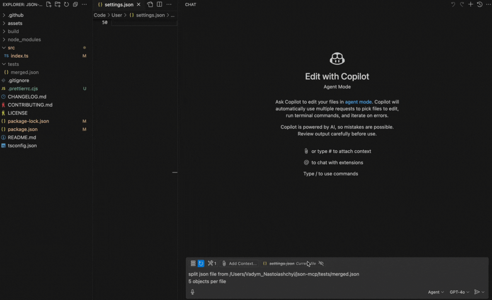

# JSON MCP

[](https://smithery.ai/server/@VadimNastoyashchy/json-mcp)

The **Model Context Protocol (MCP)** server empowers **LLMs** to efficiently interact with JSON files. With JSON MCP, you can **split**, **merge**, and **find specific data**, **validate** within JSON files based on defined conditions.

---

<a href="https://glama.ai/mcp/servers/@VadimNastoyashchy/json-mcp">
  
</a>

---

## 🌟 Key Features

✅ **Fast and lightweight**  
✅ **LLM-friendly functionality**

---

## 🎥 Demo

Below is a demo showcasing the `split` functionality:



---

## 🔧 Use Cases (Tools)

### 1. **`split`**

Split a JSON file into a specified number of objects.

> **Note:** The file path must be provided.

**Prompt Example:**

```plaintext
Split JSON file from /Users/json-mcp/tests/merged.json
5 objects per file
```

### 2. **`merge`**

Merge JSON files into a one JSON file

> **Note:** The folder path should be provided

**Prompt Example:**

```plaintext
Merge json files from /Users/json-mcp/tests
```

---

### ⚙️ Configuration

[](https://insiders.vscode.dev/redirect?url=vscode:mcp/install?%7B%22name%22%3A%22%40VadimNastoyashchy%2Fjson-mcp%22%2C%22command%22%3A%22npx%22%2C%22args%22%3A%5B%22-y%22%2C%22%40smithery%2Fcli%40latest%22%2C%22run%22%2C%22%40VadimNastoyashchy%2Fjson-mcp%22%2C%22--key%22%2C%2292357446-baf5-439c-b7c1-b5263e221b57%22%5D%7D)

#### VS Code Manual Configuration

To configure the JSON MCP server manually in VS Code, update the **User Settings (JSON)** file:

```json
{
  "mcp": {
    "servers": {
      "json-mcp-server": {
        "command": "npx",
        "args": ["json-mcp-server@latest"]
      }
    }
  }
}
```

#### Installation in VS Code

You can install the JSON MCP server using the VS Code CLI:

```bash
# For VS Code
code --add-mcp '{"name":"json-mcp-server","command":"npx","args": ["json-mcp-server@latest"]}'
```

After installation, the JSON MCP server will be available for use with your GitHub Copilot agent in VS Code.

#### Claude Desktop

To install json-mcp for Claude Desktop automatically via [Smithery](https://smithery.ai/server/@VadimNastoyashchy/json-mcp):

```bash
npx -y @smithery/cli install @VadimNastoyashchy/json-mcp --client claude
```

---

### ⚙️ Installation Server

#### Install globally

```bash
npm install -g json-mcp-server@latest
```

#### Run after global installation

```bash
json-mcp-server
```

#### Using npx with latest version (recommended)

```bash
npx json-mcp-server@latest
```
